<div align="center">



# Ricky-7-Yan

### AI Agent Engineer · Open-Source Contributor

<a href="https://github.com/Ricky-7-Yan">
  
</a>

`AI Agent 工程师` · `开源贡献者` · `Auditable AI Systems`

*If you can,you can!*

[GitHub](https://github.com/Ricky-7-Yan) · [Email](mailto:2314530442@qq.com)

<kbd>● ONLINE</kbd> <kbd>⚙ AGENT BUILDER</kbd> <kbd>◆ OPEN SOURCE</kbd> <kbd>⌁ BUILD · VERIFY · SHARE</kbd>

</div>



<table>
<tr>
<td width="58%" valign="top">

### `⌁ ~/whoami`

```text
$ mission --build --verify
  Auditable AI agents and evidence-grounded workflows.

> 构建可审计、可验证、可落地的 AI Agent
> 持续参与优秀 AI 与开发者工具项目
```

</td>
<td width="42%" valign="top">

### `◈ ~/focus`

- `01` Agent reliability & evaluation
- `02` Open-source collaboration
- `03` Developer tools & testing
- `04` Computer vision systems

</td>
</tr>
</table>

### `◉ ~/mission-control`



### `⚡ ~/stack`

<table>
<tr>
<td width="50%" align="center">
<sub>◈ AI / AGENT CORE</sub><br /><br />
<kbd>Python</kbd> <kbd>AI Agents</kbd> <kbd>MCP</kbd> <kbd>Computer Vision</kbd>
</td>
<td width="50%" align="center">
<sub>⚙ ENGINEERING DECK</sub><br /><br />
<kbd>TypeScript</kbd> <kbd>FastAPI</kbd> <kbd>React</kbd> <kbd>Docker</kbd> <kbd>PostgreSQL</kbd>
</td>
</tr>
</table>

### `✦ ~/featured-work`

| Project | Role | Focus |
| :--- | :---: | :--- |
| [**intelligent-audit-system**](https://github.com/Ricky-7-Yan/intelligent-audit-system) | `🟦 FLAGSHIP` | 🤖 Auditable enterprise AI agents and governed workflows |
| [**microsoft/agent-framework**](https://github.com/microsoft/agent-framework) | `🟪 MERGED` | 🧩 Agent SDKs, orchestration and concurrency reliability |
| [**Tencent/YOLO-Master**](https://github.com/Tencent/YOLO-Master) | `🟪 MERGED` | 👁 Computer vision, MoE and deployment validation |
| [**The-PR-Agent/pr-agent**](https://github.com/The-PR-Agent/pr-agent) | `🟪 MERGED` | 🛠 AI-assisted pull-request review and developer tooling |
| [**gptme/gptme**](https://github.com/gptme/gptme) | `🟪 MERGED` | 💻 Terminal agents, local tools and background jobs |
| [**bytedance/deer-flow**](https://github.com/bytedance/deer-flow) | `🟪 MERGED` | 🧠 Long-horizon agents, checkpoints and reliability testing |

<details>
<summary><b>✧ Verified merged PRs · 已合并贡献记录</b></summary>

- **YOLO-Master:** [#88](https://github.com/Tencent/YOLO-Master/pull/88) · [#94](https://github.com/Tencent/YOLO-Master/pull/94) · [#95](https://github.com/Tencent/YOLO-Master/pull/95)
- **PR-Agent:** [#2870](https://github.com/The-PR-Agent/pr-agent/pull/2870)
- **gptme:** [#3673](https://github.com/gptme/gptme/pull/3673)
- **DeerFlow:** [#5051](https://github.com/bytedance/deer-flow/pull/5051)
- **Microsoft Agent Framework:** [#7680](https://github.com/microsoft/agent-framework/pull/7680)

</details>

### `◫ ~/live-signals`

<!-- profile-stats:start -->
<!-- Updated automatically from the GitHub GraphQL API. -->
| ⭐ Owned repo stars | 📦 Public repos | 🟩 Contributions (1 year) |
| :---: | :---: | :---: |
| **1,179** | **54** | **343** |

| 💾 Commits (1 year) | 🔀 Pull requests (1 year) | 💬 Issues (1 year) |
| :---: | :---: | :---: |
| **245** | **45** | **3** |

| 🔥 Current streak | 🏆 Longest streak (1 year) | 🤝 External repos contributed to |
| :---: | :---: | :---: |
| **10 days** | **10 days** | **31** |
<!-- profile-stats:end -->

<sub>Official GitHub data · refreshed automatically when the numbers change</sub>


<div align="center">

⌁ <kbd>Travel</kbd> <kbd>Food</kbd> <kbd>Sports</kbd> <kbd>AI</kbd> ⌁<br />
旅行 · 美食 · 运动 · AI

<sub>Let's build systems that can be trusted — and software worth sharing.</sub>

</div>
