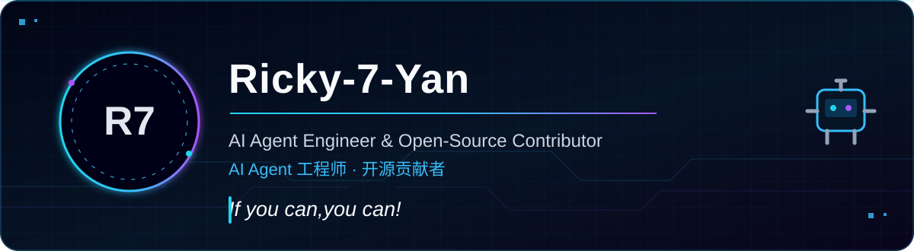
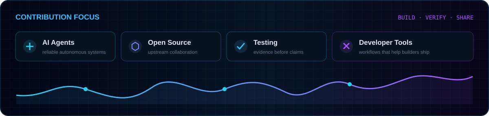
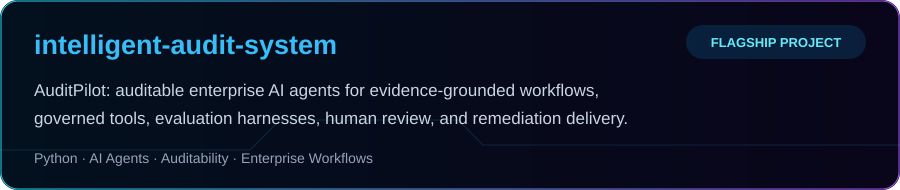
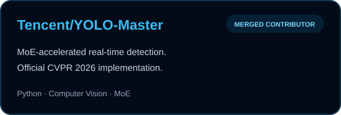
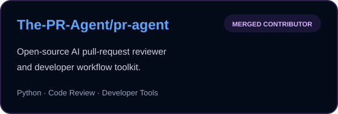
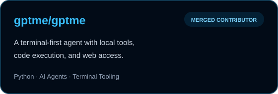
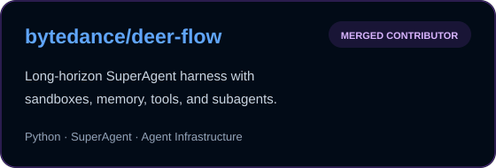

<div align="center">



<br />


### AI Agent Engineer · Open-Source Contributor

**构建可审计、可验证、可落地的 AI Agent，也为优秀的开源项目持续贡献。**<br />
*Building auditable, verifiable AI agents — and contributing where open source moves AI forward.*

[](https://github.com/Ricky-7-Yan)
[](mailto:2314530442@qq.com)
[](https://github.com/Ricky-7-Yan)

</div>

<br />



## `01 / TECH_STACK`

<div align="center">


</div>

## `02 / OPEN_SOURCE_SIGNAL`

<div align="center">



</div>

## `03 / FEATURED_PROJECTS`

### Flagship · 个人旗舰项目

<div align="center">

<a href="https://github.com/Ricky-7-Yan/intelligent-audit-system"></a>

</div>

### Merged Contributor · 已合并贡献

<div align="center">

<a href="https://github.com/Tencent/YOLO-Master"></a>
<a href="https://github.com/The-PR-Agent/pr-agent"></a>
<a href="https://github.com/gptme/gptme"></a>
<a href="https://github.com/bytedance/deer-flow"></a>

</div>

<details>
<summary><b>Verified merged contributions · 已合并贡献记录</b></summary>

- **Tencent/YOLO-Master:** [#88](https://github.com/Tencent/YOLO-Master/pull/88) · [#94](https://github.com/Tencent/YOLO-Master/pull/94) · [#95](https://github.com/Tencent/YOLO-Master/pull/95)
- **The-PR-Agent/pr-agent:** [#2870](https://github.com/The-PR-Agent/pr-agent/pull/2870)
- **gptme/gptme:** [#3673](https://github.com/gptme/gptme/pull/3673)
- **bytedance/deer-flow:** [#5051](https://github.com/bytedance/deer-flow/pull/5051)

</details>

## `04 / CURRENT_VECTOR`

```text
> building     auditable AI agent systems
> exploring    agent reliability · evaluation · MCP · computer vision
> contributing tests · developer tooling · production-grade workflows
> open_to      meaningful AI and open-source collaboration
```


<div align="center">

### `Travel · Food · Sports · AI`

旅行 · 美食 · 运动 · AI

**If you can,you can!**

<sub>Let's build systems that can be trusted — and software worth sharing.</sub>

</div>
