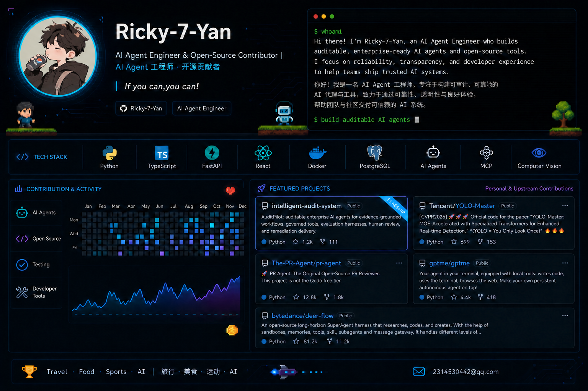

 

<a href="https://github.com/Ricky-7-Yan/intelligent-audit-system"><kbd>FLAGSHIP · intelligent-audit-system</kbd></a>
<a href="https://github.com/Tencent/YOLO-Master"><kbd>YOLO-Master</kbd></a>
<a href="https://github.com/The-PR-Agent/pr-agent"><kbd>PR-Agent</kbd></a>
<a href="https://github.com/gptme/gptme"><kbd>gptme</kbd></a>
<a href="https://github.com/bytedance/deer-flow"><kbd>DeerFlow</kbd></a>

<b>Verified merged contributions · 已合并贡献</b>

- **Tencent/YOLO-Master:** [#88](https://github.com/Tencent/YOLO-Master/pull/88) · [#94](https://github.com/Tencent/YOLO-Master/pull/94) · [#95](https://github.com/Tencent/YOLO-Master/pull/95)
- **The-PR-Agent/pr-agent:** [#2870](https://github.com/The-PR-Agent/pr-agent/pull/2870)
- **gptme/gptme:** [#3673](https://github.com/gptme/gptme/pull/3673)
- **bytedance/deer-flow:** [#5051](https://github.com/bytedance/deer-flow/pull/5051)

[2314530442@qq.com](mailto:2314530442@qq.com) &nbsp;·&nbsp; `If you can,you can!`

